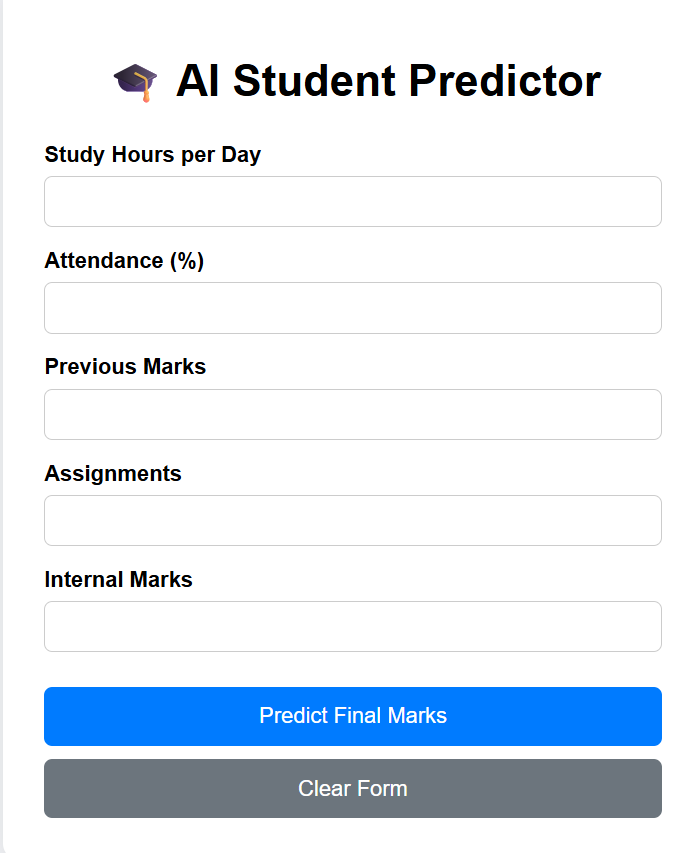
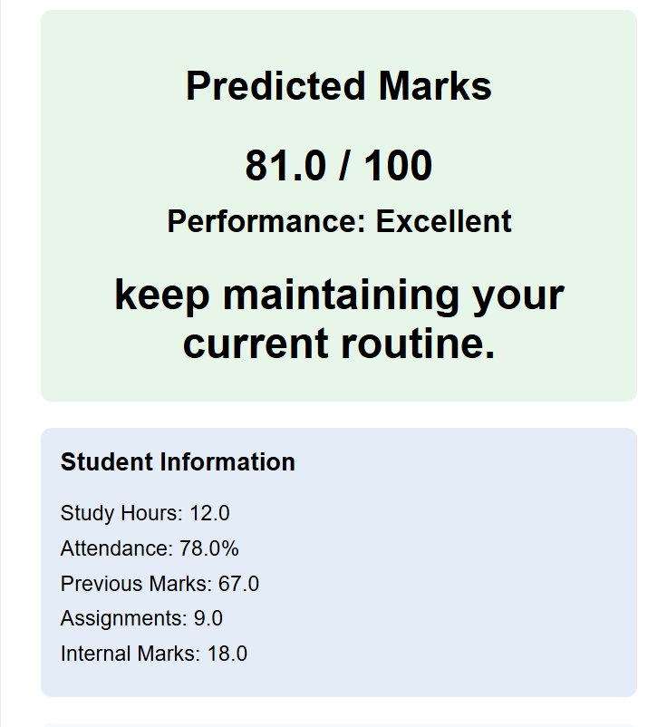

# AI Student Performance Predictor

## Overview
AI Student Performance Predictor is a machine learning web application
that predicts a student's final marks based on academic inputs such as
study hours, attendance, previous marks, assignments, and internal marks.

The project uses Linear Regression for prediction and Flask to provide
a web-based interface.

## Dataset

The dataset used in this project is synthetically generated for learning
and demonstration purposes.

It should not be considered a real-world educational dataset, and the
predictions should not be used to make actual academic decisions.

## Technologies Used

- Python
- Pandas
- NumPy
- Scikit-learn
- Flask
- HTML
- CSS
- Joblib
## Machine Learning Workflow

1. Generate the student dataset.
2. Load and prepare the data.
3. Separate input features and target values.
4. Split the dataset into training and testing sets.
5. Train a Linear Regression model.
6. Train a Random Forest model for comparison.
7. Evaluate both models using Mean Absolute Error (MAE).
8. Save the trained Linear Regression model.
9. Use Flask to accept student information.
10. Generate and display the predicted marks.

## Features

- Predicts final marks from student academic information
- Input validation for all fields
- Performance classification:
  - Excellent
  - Good
  - Average
  - Needs Improvement
- Provides a basic recommendation based on predicted performance
- Displays the student's entered information
- Shows model evaluation using MAE
- Compares Linear Regression with Random Forest
- Displays the learned Linear Regression coefficients
- Simple web interface using Flask

## Project Structure

```text
ai project/
│
├── generate_data.py
├── train.py
├── app.py
├── data.csv
├── student_model.pkl
├── templates/
│   └── index.html
└── README.md


## Input Features

| Feature | Range | Description |
|---|---:|---|
| Study Hours | 0–16 | Study hours per day |
| Attendance | 0–100 | Attendance percentage |
| Previous Marks | 0–100 | Previous academic marks |
| Assignments | 0–10 | Number/score of assignments |
| Internal Marks | 0–20 | Internal assessment marks |

## Model Performance

The models were evaluated using Mean Absolute Error (MAE).

| Model | MAE |
|---|---:|
| Linear Regression | 2.67 |
| Random Forest | 4.07 |

Lower MAE indicates a smaller average absolute prediction error on the
held-out test data.

These results are specific to the synthetically generated dataset used
in this project and should not be interpreted as real-world student
prediction accuracy.

## Installation

### 1. Clone the repository

```bash
git clone <your-github-repository-url>
cd ai-project

2. Create a virtual environment
python -m venv .venv

3. Activate the virtual environment
For Windows:
.venv\Scripts\activate

4. Install dependencies
pip install pandas numpy scikit-learn flask joblib


### What each command means

**Clone:**

```bash
git clone <your-github-repository-url>

Downloads your project from GitHub to another computer.

Create virtual environment:
python -m venv .venv

Creates an isolated Python environment for this project.
Activate:
.venv\Scripts\activate

Activates that environment on Windows.
You should then see something like:
(.venv) C:\...\ai-project>

Install dependencies:
pip install pandas numpy scikit-learn flask joblib

Installs the Python libraries your project needs.

## Generate Dataset

Run the following command:

```bash
python generate_data.py

This generates a synthetic dataset named data.csv.
The dataset contains the following features:
- Study hours
- Attendance
- Previous marks
- Assignments
- Internal marks
- Final marks
The generated dataset is used to train and evaluate the machine learning models.


### What happens when you run it?

Your program:

```text
generate_data.py
       ↓
generates 1000 student records
       ↓
data.csv
       ↓
used by train.py


## Train the Model

After generating the dataset, run:

```bash
python train.py

This script:
1. Loads the data.csv dataset.
2. Separates the input features and target (final_marks).
3. Splits the data into training and testing sets.
4. Trains a Linear Regression model.
5. Trains a Random Forest Regression model for comparison.
6. Evaluates both models using Mean Absolute Error (MAE).
7. Saves the trained Linear Regression model and evaluation metrics to student_model.pkl.


### What happens behind the scenes?

```text
data.csv
   ↓
train.py
   ↓
Training data ──→ Linear Regression
   │
   └────────────→ Random Forest
                    ↓
              Compare MAE
                    ↓
          Save trained model
                    ↓
        student_model.pkl


Your latest training produced:
Linear Regression MAE: 2.67
Random Forest MAE: 4.07

These values can change slightly whenever you regenerate the synthetic dataset.

## Run the Web Application

After training the model, start the Flask web application using:

```bash
python app.py

The terminal should show that the Flask development server is running.
Open the URL shown in the terminal, usually:
http://127.0.0.1:5000/

The web application allows the user to enter:
- Study hours
- Attendance
- Previous marks
- Assignments
- Internal marks
After submitting the form, the application predicts the student's final marks and displays a performance category and recommendation.


## How the Prediction Works

The prediction process works as follows:

1. The user enters academic information into the web form.
2. Flask receives the submitted data.
3. The input values are validated.
4. The values are converted into a Pandas DataFrame.
5. The trained Linear Regression model receives the input data.
6. The model predicts the student's final marks.
7. The prediction is rounded to one decimal place.
8. The application classifies the predicted marks into a performance category.
9. A recommendation is displayed to the user.

### Prediction Flow

```text
Student Input
     ↓
Flask Web Application
     ↓
Input Validation
     ↓
Pandas DataFrame
     ↓
Trained Linear Regression Model
     ↓
Predicted Final Marks
     ↓
Performance Classification
     ↓
Recommendation
     ↓
Result Displayed

### One important thing to understand

Your project has **two separate phases**:

**Training phase**
```text
data.csv → train.py → ML model → student_model.pkl

Prediction phase
User Input → app.py → student_model.pkl → Prediction

## Limitations

This project has some limitations:

- The dataset is synthetically generated and does not represent real student data.
- The prediction accuracy depends on the quality of the generated dataset.
- The model uses only five academic features.
- The current Linear Regression model assumes a mostly linear relationship between inputs and final marks.
- The predictions should not be used for actual academic decisions.
- The Flask application is intended for learning and demonstration purposes.

## Future Improvements

The project can be improved in several ways:

- Use a real and ethically collected student dataset.
- Add more relevant features such as study consistency, previous semester performance, sleep hours, and extracurricular activities.
- Experiment with additional machine learning algorithms.
- Perform hyperparameter tuning.
- Add data visualization and performance charts.
- Improve the user interface and user experience.
- Add user authentication and student history.
- Deploy the application online.
- Add explainable AI techniques to provide better explanations for predictions.
- Add more comprehensive model evaluation metrics.


## Project Demo

The application provides a simple web interface where users can enter
student academic information and receive a predicted final mark.

### Input Form

The user can enter:

- Study hours
- Attendance
- Previous marks
- Assignments
- Internal marks

### Prediction Result

After submitting the form, the application displays:

- Predicted final marks
- Performance category
- Personalized recommendation
- Entered student information
- Model information
- Model comparison
- Linear Regression coefficients

### Screenshots

Add screenshots of the application here.

#### Home Page



#### Prediction Result

